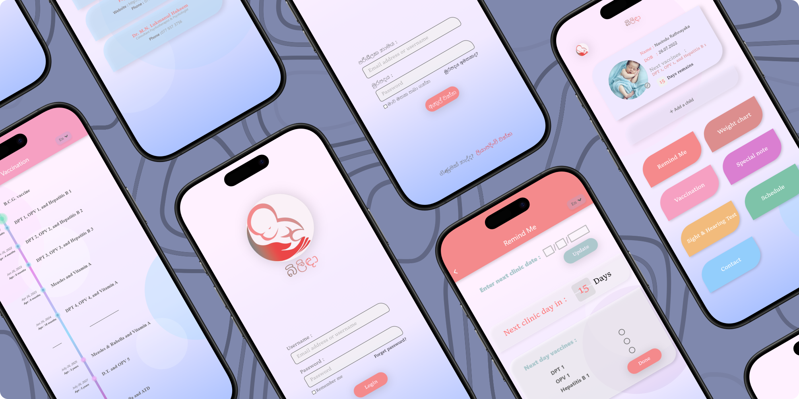

# Bilida - Child Health and Development Tracking App

Bilida is a user-friendly mobile application designed to help mothers manage their child's healthcare routines and development with ease. The app offers a comprehensive solution for tracking important aspects of child health, making it easier to balance parenting with other responsibilities.

## Features

1. **Remind Me:** Get timely reminders for upcoming clinical dates and appointments.
2. **Vaccination:** View a complete vaccination timeline with detailed information on each vaccine.
3. **Weight Chart:** Track your baby’s weight using a digital weight chart.
4. **Hearing and Sight Test:** Log and mark the results of your child's hearing and sight tests.
5. **Schedule:** Plan and manage your baby's daily schedule with ease.
6. **Contact:** Keep important contacts related to your child's healthcare in one place.
7. **Special Notes:** Add custom notes for any special instructions or observations regarding your child's health.

## Purpose

Bilida is developed to support mothers in providing the best possible care for their children, simplifying healthcare tracking while ensuring nothing is overlooked.

## Technologies Used

- Flutter and Firebase
- Easy Localization

